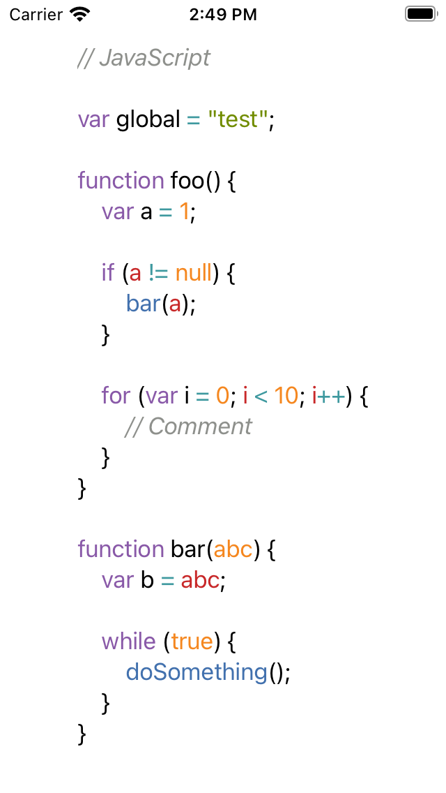
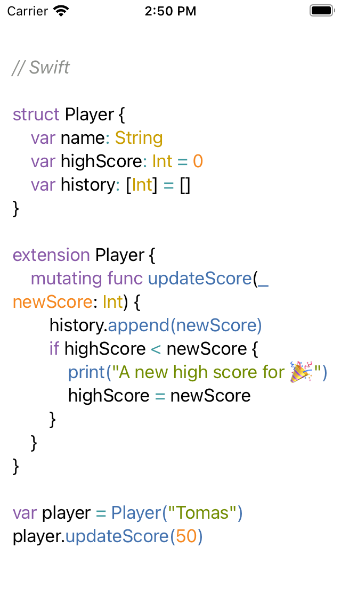

# SyntaxHighlight

SyntaxHighlight makes TextMate-style syntax highlighting easy for SwiftUI.




## Usage

SyntaxHighlight uses `.tmTheme` and `.tmLanguage.json` files to highlight source code. None are provided with SyntaxHighlight. Thankfully, there are tons available at [Visual Studio Code Extensions](https://github.com/microsoft/vscode/tree/master/extensions) and [TextMate's GitHub org](https://github.com/textmate).

```swift
import SwiftUI
import SyntaxHighlight

struct ContentView: View {
    var theme = try! Theme(contentsOf: Bundle.main.url(forResource: "Tomorrow", withExtension: "tmTheme")!)
    var grammar = try! Grammar(contentsOf: Bundle.main.url(forResource: "JavaScript.tmLanguage", withExtension: "json")!)
    
    var body: some View {
        Text(from: Highlighter(string: "// JavaScript", theme: theme, grammer: grammar))
    }
}
```

## Installation

SyntaxHighlight is available through [Swift Package Manager](https://github.com/apple/swift-package-manager/).

```swift
let package = Package(
    ...
    dependencies: [
        .package(url: "https://github.com/maoyama/SyntaxHighlight.git", from: "0.1.0")
    ],
    ...
)
```

## Requirements
- iOS13+
- macOS Catalina


